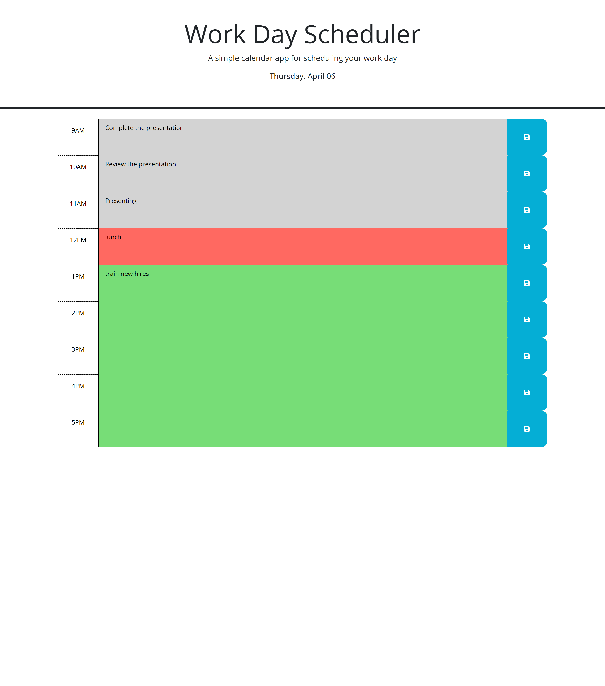

# Work Day Scheduler

## Description

This project was built to create a schedule for working hours. It makes it easy for us to save the task and we can come back and add more to our schedule. Through this project i learn more about Third part API's

## Installation

N/A

## Usage

This website is a work day scheduler, which will show 8 working hours [9 am - 5 pm]. We can add our task in each section and can save it. we can come back later and add more task and task we created earlier will be present on the same page as it is stored in local storage. It also synchorize with current time and shows different colours for upcoming taks, tasks which are already comepleted and current tasks. Grey colour indicate tasks which are in past hours, red will show tasks in current hour and green will show tast in future hours. Screenshot of the website is attached below.

## Credits

[WS Schools](https://www.w3schools.com/jquery/) - I used this to get some clear view on the jquery

## License

MIT License

## Link 
[Link for deployed website](https://saloni0412.github.io/Scheduler/)